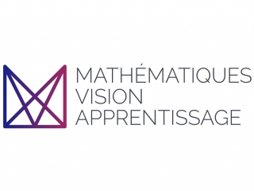

# M2 Master MVA (MATHÉMATIQUES, VISION, APPRENTISSAGE)

This repository contains different projects and assignments that I did, alone or with other students, in the [MVA Master](https://www.master-mva.com) at the ENS Paris-Saclay and I consider useful. I remark that there is no guarantee with regards to the accuracy of the answers and results given here. 

## List of courses
### First semester

* [Computational Statistics](Computational) Grade 18.00/20.00

### Second semester
* [Deep Learning in Practice](https://github.com/israfelsr/assignments-mva/tree/main/dl-in-practice) (Collected in the GitHub of Israfel Salazar)
* [Graphs in Machine Learning](graphs-ML)
* [Bayesian Machine Learning](https://github.com/israfelsr/assignments-mva/tree/main/dl-in-practice)
